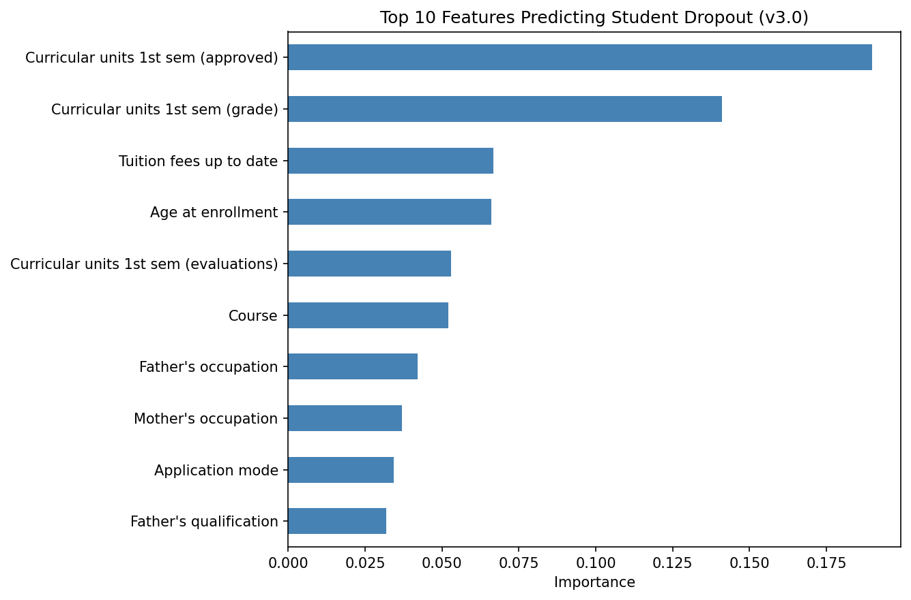

# Students Dropout Predictor

A machine learning model that predicts which students are at risk of dropping out, built with a Random Forest classifier. The model is meant to support early, human-led intervention, not to label students.

## Problem
Identifying at-risk students early helps schools and education programs offer support before a student drops out.

## Dataset
- **Name:** Predict Students' Dropout and Academic Success
- **Source:** UCI Machine Learning Repository (via [Kaggle](https://www.kaggle.com/datasets/thedevastator/higher-education-predictors-of-student-retention))
- **Records:** 4,424 students
- **Features:** 35 original features (28 after removing features that caused data leakage)
- **Target:** Dropout, Enrolled, Graduate, reframed as binary: **Dropout vs. Not_Dropout**

## Method
1. Data cleaning and exploration
2. Feature engineering (total approved units, approval rate, average grade, financial risk)
3. Removal of second-semester features to fix data leakage
4. 80/20 train-test split
5. Random Forest training (100 trees, class weights: Dropout = 3, Not_Dropout = 1)

## Results (v3.0, leakage-free, binary)

| Metric | Score |
|---|---|
| Overall accuracy | 84.18% |
| Dropout precision | 86% |
| Dropout recall | 66% |
| Not_Dropout recall | 94% |

**Interpretation:** The model correctly identifies 66% of students at risk of dropping out. When it flags a student, it is right 86% of the time.

## Top Predictive Features
1. Curricular units approved, 1st semester (early academic performance)
2. Curricular units grade, 1st semester (early academic performance)
3. Tuition fees up to date (financial stability)
4. Age at enrollment (older students are more at risk)
5. Curricular units evaluated, 1st semester (academic engagement)

## Ethical Safeguards
- **Human-in-the-loop:** model output only informs counselor conversations.
- **Framing:** students are flagged as "needing support," never "likely to fail."
- **Gender check:** subgroup performance by gender must be reviewed before deployment.
- **Consent and privacy:** student data consent and privacy norms must be established before real-world use.

## Next Steps
Apply the same methodology to primary and secondary school (basic education) data in Nigeria, where dropout has the most serious consequences.

## Files
- `student_dropout_predictor.ipynb`: full analysis and model notebook
- `Student Dropout Predictor _Model _Card .pdf`: model card summarizing the approach and results

## Tools
Python, pandas, scikit-learn, matplotlib, Jupyter Notebook
